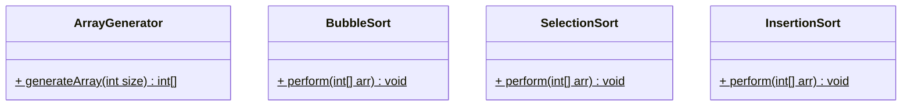

# Another Git Demo

Willkommen zum 2. Teil der Einleitung zum Thema "Version Control mit Git". 

Das letze Mal haben wir über die Grundlagen von Git gesprochen und dieses mal sollt ihr es selbst anhand eines Beispiels in euren gewöhnlichen SYP Teams ausprobieren.

Solltet ihr euch mittlerweile nicht mehr sicher sein, wie Git funktioniert, könnt ihr jederzeit im [git-introduction](https://github.com/JonasSchweigler/git-introduction) Repository nachlesen.

----

## Die Aufgabe

Eure Aufgabe wird es sein, ein kleines Java-Projekt in eurem Team aufzuteilen und gemeinsam umzusetzen. Hierbei haben wir uns folgendes Projekt ausgedacht:

Das Tool **Java-Sorter** soll in der Lage sein, einen Array mit zufälligen Zahlen zu generieren und diesen mit drei unterschiedlichen Sortieralgorithmen zu sortieren. Die Klassendiagramme für das Projekt sehen wie folgt aus:

Die **Main-Methode** soll in der **ArrayGenerator** Klasse implementiert werden.

Die Anzahl der Klassen ist hierbei nicht willkürlich gewählt, sondern jedes Mitglied des Teams soll hierbei eine der Klassen übernehmen und diese in einem eigenen Branch ausimplementieren. Sollte dies erledigt sein, so soll jenes Mitglied seinen Branch auf das Remote-Repository des Teams pushen. Das Ziel ist es, am Ende ein funktionierendes Projekt im master / main Branch zu haben.

Viel Erfolg :D